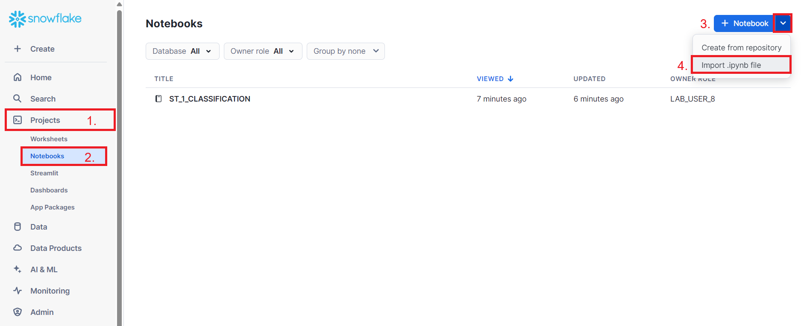

# ni-mlp-lab
Python notebooks for Snowflake AI testing

## Přihlášení
Přihlaste se na Snowflake účet dle pokynů sdělených během cvičení. 

Přihlaste se na Snowflake účet dle pokynů sdělených během cvičení.

URL - <ee03246.ca-central-1.aws.snowflakecomputing.com>

Credentials - viz tabulka 

PASSWORD = 'NI-MLP-User-{x}' 

LOGIN_NAME = 'MLP_USER_{x}'

Kde x je vam pridelene cislo.

## Úlohy
Stáhněte si všechny Python notebooky z tohoto repozitáře na svůj lokální počítač. Následně si je nahrajte do svého Snowflake workspacu:
1. V levém panelu zvolíme Projects
2. Na vyjížděcím menu zvolíme Notebooks
3. Vpravo nahoře zvolíme šipku u tlačítka + Notebook
4. Zvolíme import .ipynb file
5. Nastavíme _Notebook location_
   - databáze _NI_MLP_LAB_
   - schéma dle vašeho uživatele (NE _LAB_!, NE _PUBLIC_!)
   - runtime ponecháme na _Run on warehouse_
   - runtime version ponecháme na _Snowflake Warehouse Runtime 2.0_
   - query warehouse nastavíme podle našeho uživatelského jména na _LAB_USER_EVEN_ nebo _LAB_USER_ODD_
   - notebook warehouse necháme defaultní

Poté začněte s první úlohou dle pokynů v notebooku, pak pokračujte s druhou úlohou.
